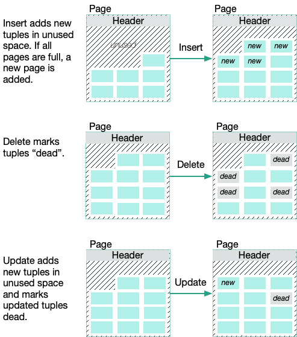
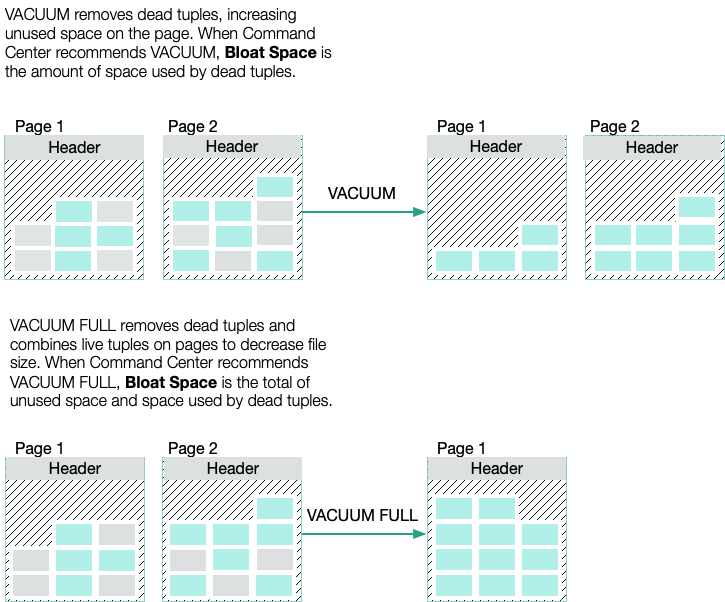
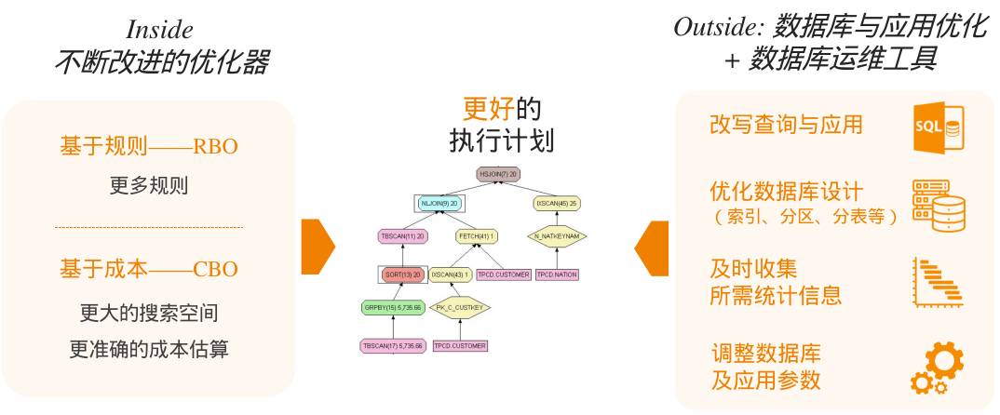

# PostgreSQL数据库系统优化

[TOC]

## 大纲

相信大家都听说过一道面试题《当我们在浏览器输入<http://www.google.com>, 点击回车之后发生了什么》这个问题讲的越清楚，越能对优化感同身受。

近几年BDC团队在不断实践中沉淀出不少数据库优化技巧，当然也适用于其他服务，原理相通。希望大家先对整体优化思路有个概念，然后再抓细节，毕竟优化是个系统工程，优化的时候要做到**抓大放小**。

### 目标，受众，结果

面向编写 SQL 的用户，了解 PostgreSQL 基础原理，掌握核心的优化思路，和优化方法。

### 数据库优化的核心思想

1.  减少磁盘IO
2.  高效利用内存
3.  减少计算量
4.  减少数据重分布

### 数据库调优思维导图

思维导图涵盖 BDC 近四五年所有优化经验，并持续更新中，非一人之功，集合了各位同事的智慧和经验。

https://www.processon.com/view/link/6449f74e97ae6a44256debf5

## N 个 SQL 小问题

### 问题 1. 更新操作(UPDATE/DELETE)是否会阻塞读操作(SELECT)？

**关键词:**

- **Lock Wait:** 当一个事务对某一行数据进行更新时，它可能会获取锁，如果其他事务正试图读取或更新相同的数据，则它们需要等待锁的释放。这可能导致读操作被阻塞。

- **MVCC(Multi-Version Concurrency Control):** 数据库系统通过在事务开始时创建数据的快照，允许不同的事务同时读取相同的数据。在更新时，新的数据版本被创建，而不是在原地修改。这可以避免读取操作被阻塞。

**典型场景:**

- 数据库同步:同步 SQL Server 数据至 PostgreSQL，SQL Server 未开启 Read-Commited Snaphot 时，在读取数据时可能被更新操作所阻塞。
- Online DDL:表结构变更，比如添加字段、修改字段类型、添加约束等

**核心知识:**

| Runs concurrently with | SELECT | INSERT<br>UPDATE<br>DELETE | CREATE INDEX CONC<br>VACUUM<br>ANALYZE | CREATE INDEX | CREATE TRIGGER | ALTER TABLE<br>DROP TABLE<br>TRUNCATE<br>VACUUM FULL |
| --- | --- | --- | --- | --- | --- | --- |
| **SELECT** | ✅ | ✅ | ✅ | ✅ | ✅ | ❌ |
| **INSERT<br>UPDATE<br>DELETE** | ✅ | ✅ | ✅ | ❌ | ❌ | ❌ |
| **CREATE INDEX CONC<br>VACUUM<br>ANALYZE** | ✅ | ✅ | ❌ | ❌ | ❌ | ❌ |
| **CREATE INDEX** | ✅ | ❌ | ❌ | ✅ | ❌ | ❌ |
| **CREATE TRIGGER** | ✅ | ❌ | ❌ | ❌ | ❌ | ❌ |
| **ALTER TABLE<br>DROP TABLE<br>TRUNCATE<br>VACUUM FULL** | ❌ | ❌ | ❌ | ❌ | ❌ | ❌ |

**参考链接:**
- [PostgreSQL rocks, except when it blocks: Understanding locks](https://www.citusdata.com/blog/2018/02/15/when-postgresql-blocks/) 虽然 PG 很稳定，但锁问题还是值得注意的
- [When Postgres blocks: 7 tips for dealing with locks](https://www.citusdata.com/blog/2018/02/22/seven-tips-for-dealing-with-postgres-locks/) 7条关于锁的建议，线上运维前必看指南
- [Select for update 行锁 or 表锁，20个场景分析](https://mp.weixin.qq.com/s/I2YwHcLbaT5i0TKLDIpHdQ) 
- [07 | 行锁功过:怎么减少行锁对性能的影响？](https://time.geekbang.org/column/article/70215) 高并发场景下锁等待造成CPU 100%问题

### 问题 2. 某表数据才 3w 条，物理空间占了 30G，查询巨慢

**关键词:**

`Table Bloat`，`Reindex`, `Analyse`, `Vacuum`

**典型场景:**

- 数据频繁更新:`public.kbase_git_alarm` 异常更新，表的实际存储空间远超预期。
- 数据模型修正:`dw.dim_cpu_model` 全表重算，存储空间膨胀

**核心知识:**

PG 中的数据膨胀问题，通常是由于数据更新导致的，数据更新包括 UPDATE、DELETE 等操作:



为了优化磁盘空间，减少磁盘碎片，PG 引入了 VACUUM 命令，该命令会回收被删除数据所占用的空间，并将这些空间归还给操作系统。



以数据归档为例，详细说明一下 VACUUM 和 VACUUM FULL 两者的差异:

|     | 无VACUUM | VACUUM | VACUUM FULL |
| --- | --- | --- | --- |
| 删除大量数据之后 | 只是将删除数据的状态置为已删除，该空间不能记录被重新使用。 | 如果删除的记录位于表的末端，其所占用的空间将会被物理释放并归还操作系统。如果不是末端数据，该命令会将指定表或索引中被删除数据所占用空间重新置为可用状态，那么在今后有新数据插入时，将优先使用该空间，直到所有被重用的空间用完时，再考虑使用新增的磁盘页面 | 不论被删除的数据是否处于数据表的末端，这些数据所占用的空间都将被物理的释放并归还于操作系统。之后再有新数据插入时，将分配新的磁盘页面以供使用 |
| 执行效率 |     | 由于只是状态置为操作，因此效率较高 | 该命令会为指定的表或索引重新生成一个数据文件，并将原有文件中可用的数据导入到新文件中，之后再删除原来的数据文件。因此在导入过程中，要求当前磁盘有更多的空间可用于此操作。由此可见，该命令的执行效率相对较低 |
| 被删除的数据所占用的物理空间是否被重新规划给操作系统 | 不会  | 不会  | 会   |
| 在执行VACUUM命令时，是否可以并发执行针对该表的其他操作 |     | 由于该操作是共享锁，因此可以与其他操作并行进行 | 由于该操作需要在指定的表上应用排它锁，因此在执行该操作期间，任何基于该表的操作都将被挂起，知道该操作完成 |
| 推荐使用方式 | 在进行数据清空时，可以使用truncate操作，因为该操作将会物理的清空数据表，并将其所占用的空间直接归还于操作系统 | 为了保证数据表的磁盘页面数量能够保持在一个相对稳定值，可以定期执行该操作，如每天或每周中数据操作相对较少的时段 | 考虑到该操作的开销，以及对其他错误的排斥，推荐的方式是，定期监控数据量变化较大的表，只有确认其磁盘页面占有量接近临界值时，才考虑执行一次该操作。即便如此，也需要注意尽量选择数据操作较少的时段来完成该操作 |
| 执行后其它操作的效率 | 对于查询而言，由于存在大量的磁盘页面碎片，因此效率会逐步降低 | 相比于不执行任何VACUUM操作，其效率更高，但是插入的效率会有所降低 | 在执行完该操作后，所有基于该表的操作效率都会得到极大的提升 |

**参考链接:**

- [PostgreSQL documentation - Routine Vacuuming](https://www.postgresql.org/docs/current/routine-vacuuming.html#AUTOVACUUM)
- [PostgreSQL documentation - Routine Reindexing](https://www.postgresql.org/docs/current/routine-reindex.html) 什么情况下要执行 REINDEX
- [使用PostgreSQL数据库的SQL Server DBA：事务隔离和表膨胀](https://mp.weixin.qq.com/s?__biz=MzI5MTQ3ODU4Nw==&mid=2247484810&idx=1&sn=360304093f2fbb67249ab1d37200e202&chksm=ec1148dedb66c1c81466d0105c968bcee83b29f593998f32f3cb1c5cacc120b69976fd36929f)
- [Manage Bloated Postgres Database](https://imantung.medium.com/manage-bloated-postgres-database-22e14ce382a9) 数据库容量膨胀之后常规的应对措施

### 问题 3. SQL 没修改，但执行时间却陡增，是数据库出问题了吗？

**关键词:**

数据库执行计划，动态规划算法，遗传算法，贪婪算法

**典型场景:**

- 多表关联查询: 关联查询间歇性慢，首先怀疑执行计划中存在表统计信息不准确的情况，或者表数据量变大之后数据库选择了不同的执行计划。
- 服务迁移: 将业务从 IPT 迁移到其他厂区时，虽然服务的版本一致，但其他厂区的数据库系统配置，模型定义(字段类型)，索引定义可能存在差异。

**核心知识:**

SQL 语言只描述要什么，不描述怎么做，是典型的“声明式”语言。查询优化技术为给定的查询(SQL)选择最高效的执行计划，就好比导航软件给我们的几种出行方案。

优化器工作原理:


执行计划调优:



**参考链接:**

- [PostgreSQL documentation - Chapter 14. Performance Tips - 14.1. Using EXPLAIN](https://www.postgresql.org/docs/current/using-explain.html) 获取一个SQL执行计划的方法
- [PostgreSQL documentation - Chapter 20. Server Configuration - 20.7. Query Planning](https://www.postgresql.org/docs/current/runtime-config-query.html) 官方文档，讲解约束执行计划的若干选项
- [А deep dive into PostgreSQL query optimizations](https://postgrespro.com/blog/pgsql/5968054) 优化示例较多，但各个比较经典
- [PostgreSQL poor performance because of bad query plan based on bad row estimates](https://dba.stackexchange.com/questions/317203/postgres-poor-performance-because-of-bad-query-plan-based-on-bad-row-estimates) 表统计信息不准确引起的问题
- [10 Cool SQL Optimisations That do not Depend on the Cost Model](https://blog.jooq.org/10-cool-sql-optimisations-that-do-not-depend-on-the-cost-model/) 比较老的一篇文章，详细对比了 Oracle/MySQL/SQL Server/PostgreSQL 各个数据库的执行计划，虽然比对是基于历史版本，但可借此学习一下如何比对。
- [8种经常被忽视的SQL错误用法，你有没有踩过坑？](https://juejin.cn/post/6844903998974099470) 虽然是以 MySQL 为例进行讲解，但 PostgreSQL 也大差不差

### 问题 4. 已经加了索引，但 SQL 执行时间没变化

**关键词:**

索引失效，索引无效

**典型场景:**

- 两表关联时，关联字段数据类型不一致，比如 A 表的 sn 字段是 character，而 B 表的 SN 字段是 character varying，A.SN = B.SN 时无法使用索引。推荐统一字段类型，元数据标准化规范化。
- 索引字段在表中基数比较小，比如 pdline，推荐给基数高的建索引 
- 索引字段在表中基数很高，比如 model，但可能存在未 null 的情况，且为 null 的记录还超级多，此时查询条件为 model 为 null 的时候则无法使用索引，用上索引反倒更慢
- 索引字段进行表达式计算，形如 `WHERE func(col) = 1`，更推荐修改为 `WHERE col = func(1)`
- 索引字段进行模糊匹配，BTree类型索引不支持模糊匹配，推荐使用GIN/GIN_TRGM 索引类型，比如 dw.rel_custsno 的 cust_sno 列要创建 GIN 索引
- 创建了复合索引，但查询时不符合左前缀原则，造成索引失效，或者虽然用了索引反倒更慢了。
- 索引字段进行逻辑非判断，形如 `col != ?`，此时无法使用索引

**核心知识:**

在某些情况下，尽管已经添加了索引，但 SQL 查询的执行时间并没有明显改善。这可能是由于索引无效或者在某些特定场景下索引不生效。上面典型场景中列出的反例希望大家仔细思考一下，避免踩坑。

**参考链接:**

- [PostgreSQL documentation - Chapter 11. Indexes](https://www.postgresql.org/docs/current/indexes.html) 官方文档，推荐大家了解一下 PG 中不同类型的索引
- [MySQL索引背后的数据结构及算法原理](http://blog.codinglabs.org/articles/theory-of-mysql-index.html)

### 问题 5. 多表关联操作耗时不稳定，增加索引后执行效率明显提升

**关键词:**

Nested-Loop Join，Hash Join，Merge Join，Index Nested-Loop Join

**典型场景:**

- 多表关联查询: 关联查询间歇性慢，首先怀疑执行计划中存在表统计信息不准确的情况，或者表数据量变大之后数据库选择了不同的执行计划。

**核心知识:**

以下列出了不同 Join 方式的算法复杂度，以及应用的场景:

| 算法                      | 应用场景                       | 时间复杂度          | 备注               |
| ----------------------- | -------------------------- | -------------- | ---------------- |
| Seq Scan                | 全表扫描(N)                    | O(n)           |                  |
| Seq Scan + Parallel     | 全表并行扫描(N)                  | O(n)           | 并行能力             |
| Index Scan              | 索引扫描                       | O(1) / O(n)    | 切记左前缀, 否则就得遍历整棵树 |
| Bitmap Index Scan       | 索引扫描                       | O(1) / O(n)    |                  |
| Simple Nested-Loop Join | 小结果集(M) JOIN 无索引大结果集(N)    | M \* N ≈ O(n2) | 计算量轻轻松松过千万       |
| Index Nested-Loop Join  | 小结果集(M) JOIN 有索引大结果集(N)    | M ≈ O(n)       | 有索引，性能最佳         |
| Hash Join               | 小结果集(M) JOIN 无索引大结果集(N)    | M + N ≈ O(n)   |                  |
| Hash Join + Parallel    | 小结果集(M) JOIN 无索引大结果集(N)    | M + N ≈ O(n)   | 没有索引，性能最佳        |
| Merge Join              | 无索引大结果集(M) JOIN 无索引大结果集(N) | M + N ≈ O(n)   |  看着时间复杂度不高，但是 Merge Join 需要额外的排序操作，如果数据量较大时，排序耗时会占大头    


**参考链接:**

- [JOIN Strategies AND PERFORMANCE IN POSTGRESQL](https://www.cybertec-postgresql.com/en/join-strategies-and-performance-in-postgresql/) Summary for PostgreSQL join strategies
- [Visualizing Nested Loops Joins And Understanding Their Implications](https://bertwagner.com/posts/visualizing-nested-loops-joins-and-understanding-their-implications/) Nested Loops Join 图解，博主是 SQL Server 专家，输出了很多相关知识
- [Visualizing Hash Match Join Internals And Understanding Their Implications](https://bertwagner.com/posts/hash-match-join-internals/) Hash Join 图解
- [Visualizing Merge Join Internals And Understanding Their Implications](https://bertwagner.com/posts/visualizing-merge-join-internals-and-understanding-their-implications/) Merge Join 图解
- [图解数据库连接查询(JOIN)的三种实现算法: MySQL、Oracle、SQL Server 等](https://blog.csdn.net/horses/article/details/105700677) 上面三篇文章的中文翻译，不过以不同类型数据库做了讲解，算是对原博主的细化
- [MySQL和PostgreSQL在多表连接算法上的差异](https://cloud.tencent.com/developer/article/1534897) MySQL 基于贪心算法实现，PostgreSQL 基于动态规划算法实现

### 问题 6. 用了 regexp_split_to_table 的查询耗时不稳定，大部分时候还比较快，但偶尔会慢到SQL超时

**关键词:**

regexp_split_to_table

**典型场景:**

- Grafana 查询看板提供给用户一个输入框，允许用户输入一系列 SN/PN/DN，用特定分隔符分割，在 SQL 执行过程中用户输入的字符串用`regexp_split_to_table`函数进行字符串分割。

**核心知识:**

以一个具体的例子来说明:

```sql

explain 
select * from dw.dim_cpu_po p
where p.po in ( select regexp_split_to_table('100026005459',',') );

/*
"Hash Join  (cost=22.02..1032.19 rows=1000 width=629)"
"  Hash Cond: ((p.po)::text = (regexp_split_to_table('100026005459'::text, ','::text)))"
"  ->  Seq Scan on dim_cpu_po p  (cost=0.00..935.41 rows=24241 width=629)"
"  ->  Hash  (cost=19.52..19.52 rows=200 width=32)"
"        ->  HashAggregate  (cost=17.52..19.52 rows=200 width=32)"
"              Group Key: regexp_split_to_table('100026005459'::text, ','::text)"
"              ->  ProjectSet  (cost=0.00..5.02 rows=1000 width=32)"
"                    ->  Result  (cost=0.00..0.01 rows=1 width=0)"
*/

explain 
select * from dw.dim_cpu_po p
where p.po = ANY(regexp_split_to_array('100026005459',','));
/*
"Index Scan using dim_cpu_po_pkey on dim_cpu_po p  (cost=0.29..8.30 rows=1 width=629)"
"  Index Cond: ((po)::text = ANY ('{100026005459}'::text[]))"
*/

```

regexp_split_to_table 实际上会触发一次 Join 操作，且如果  regexp_split_to_table 的预估结果集大小不准确，则可能会导致全表扫描。所以推荐将 `p.po in ( select regexp_split_to_table('100026005459',',') )` 改写为 `p.po = ANY(regexp_split_to_array('100026005459',','))`

**参考链接:**

- [Data search optimization based on a list of values presented as a string](https://postgrespro.com/blog/pgsql/5968054) 讲的很全面，不单单只是 regexp_split_to_table 这个示例
- [PostgreSQL execution plan visualizer](https://explain.dalibo.com/plan#) 执行计划可视化工具

### 问题 7. 使用 PostgreSQL FDW扩展 进行联邦查询时的注意事项

**关键词:**

postgres_fdw，greenplum_fdw，tds_fdw，influxdb_fdw，数据融合，联邦查询

**典型场景:**

- 跨库数据查询，包括同构库，异构库
- 冷热数据分离:冷数据存储在Minio，热数据存储在PG，通过FDW进行联邦查询

**核心知识:**

在使用外部数据源时，尤其是使用 Foreign Data Wrapper(FDW)连接外部数据库或文件时，需要注意一些特殊情况和常见问题。

- 谓词下推:将查询中的谓词(如WHERE、JOIN ON等)下推到外部数据源进行
- 程序Bug:FDW扩展多为第三方开发维护，难免有一些功能不足，或者Bug，目前只能是及时发现及时反馈

还是以一个具体的例子来说明一下"谓词下推":

```sql
explain analyse verbose
select * from dm.iot_sqt_dap_sensor
where time between date_trunc('hour', current_timestamp - interval '1 hour') 
        and date_trunc('hour', current_timestamp)
    and sensor in ('Flow_2')
    and device in ('CDU01');

/*
"Foreign Scan on dm.iot_sqt_dap_sensor  (cost=10.00..1.00 rows=1 width=240) (actual time=11.012..11.013 rows=0 loops=1)"
"  Output: ""time"", device, devicemodel, devicetype, line, sensor, stringvalue, value, workcell"
"  Filter: ((iot_sqt_dap_sensor.""time"" <= date_trunc('hour'::text, CURRENT_TIMESTAMP)) AND (iot_sqt_dap_sensor.""time"" >= date_trunc('hour'::text, (CURRENT_TIMESTAMP - '01:00:00'::interval))))"
"  InfluxDB query: SELECT * FROM ""dap_sensor"" WHERE ((""sensor"" = 'Flow_2')) AND ((""device"" = 'CDU01'))"
"Planning Time: 0.715 ms"
"Execution Time: 11.058 ms"
*/

explain analyse verbose 
select * from dm.iot_sqt_dap_sensor
where time between '2024-02-29 00:00:00+08'
        and '2024-02-29 01:00:00+08'
    and sensor in ('Flow_2')
    and device in ('CDU01');

/*
"Foreign Scan on dm.iot_sqt_dap_sensor  (cost=10.00..1.00 rows=1 width=240) (actual time=10.016..10.018 rows=0 loops=1)"
"  Output: ""time"", device, devicemodel, devicetype, line, sensor, stringvalue, value, workcell"
"  InfluxDB query: SELECT * FROM ""dap_sensor"" WHERE ((time >= '2024-02-28 16:00:00')) AND ((time <= '2024-02-28 17:00:00')) AND ((""sensor"" = 'Flow_2')) AND ((""device"" = 'CDU01'))"
"Planning Time: 1.036 ms"
"Execution Time: 10.080 ms"
*/
```

**参考链接:**

- [云上如何做冷热数据分离](https://developer.aliyun.com/article/66856) 阿里云，Azure 上的玩法

### 问题 8. 归档历史数据时，数据库集群主备节点数据延迟增大，实时看板变得不再实时

**关键词:**

DELETE历史数据

**典型场景:**

- 数据归档

**核心知识:**

在删除大批量数据的时候，需要使用合适的删除策略，比如针对常规堆表小批量分批次删除，针对分区表直接删除历史分区等。如果下游服务要依赖数据库的 CDC 机制进行数据同步，此时大量的 DELETE 事件会造成下游服务压力陡增，如果未做好异常保护，大概率会导致下游服务停服。针对 SQL Server，如果采用的是默认配置，在归档历史数据的时候，大概率会阻塞相关数据的查询，从而让数据库无法正常对外提供服务。

最后，留下一个问题，看看大家真正理解了吗。

如果你要删除一个表中前 10000000 行数据，有以下三种方法可以做到，你会选择哪一种方法呢？为什么呢？

1. 直接执行 `delete from T limit 10000000;`
2. 在一个连接中循环执行 200 次 `delete from T limit 50000;`
3. 在 5 个连接并发执行 `delete from T limit 50000;`，共调用 200 次

**参考链接:**

- [技术分享 | delete 语句引发大量 sql 被 kill 问题分析](https://mp.weixin.qq.com/s?__biz=MjM5NzAzMTY4NQ==&mid=2653933085&idx=1&sn=f3ecac4ab459f75fd7922d9cc15a3517&chksm=bd3b54778a4cdd61fb7b50fc7e73bc03722c78930e2bc7e9ad6751b622ddd21f547682b01944) 由于锁争用，导致 lock timeout 而被 sql-killer 干掉。在有赞的数据库运维体系中，每个实例都会配置一个 sql-killer 的实时工具，用于 kill query 超过指定阈值的 SQL 请求(类似 pt-killer)。

### 问题 9. uuid 作为主键，可能会有哪些坑 

**关键词:**

uuid，雪花算法

**典型场景:**

- 模型定义-主键

**核心知识:**

为表选择正确的主键类型时应进行适当的思考，明确不同类型主键的优缺点:

| 主键类型 | 优点 | 缺点 | 适用场景   |
| ---- | ---- | ---- | ------ |
| 自增ID SEQUENCE | 数据库内置功能<br>简单易用<br>存储高效 | 连续ID，容易被攻击<br>不适合分布式 | 适合内部系统 |
| 全局SEQUENCE | 简单易用<br>分布式专用  | 需要部署SEQUENCE服务 | 分布式系统 |
| UUID<br>示例:d23b0fcf-8205-4d12-a173-edcbde904809 | 数据库内置功能<br>简单易用<br>分布式场景 | 存储空间占用更多<br>容易产生随机IO | 分布式系统 |
| 雪花算法(时间+机器+序列号) | 性能良好，安全 | 复杂，需要由应用程序产生 | 通用，Twitter 开源的分布式 id 生成算法 |
| 组合字段(非复合主键) |             | 存储空间占用更多<br>主键约束无法限制字符串格式 | 遗留设计 |

联想一下我们目前定义的主键类型，以及我们常常看到的序列号，你就发现，相比于 UUID，SN 序列号的生成机制可以类比雪花算法，板卡的厂内 SN 序列号才是主键定义的天花板。真不知道是哪个部门定义的，真的是一块瑰宝，这块算法值得推广应用。

**参考链接:**

- [百亿美金的设计，深度剖析 GitLab 的 Postgres 数据库 Schema](https://mp.weixin.qq.com/s/cs3t_eRTcnVDFEMocpHxCA) 当数据库规模较小时，主键不会产生任何明显的影响，但当数据库规模扩大时，主键就会对存储空间、写入速度和读取速度产生明显的影响。因此，我们在为表选择正确的主键类型时应进行适当的思考。使用 UUID v4 类型而不是 bigserial 类型时，表的大小会增加 25%，插入效率则会下降到 bigserial 类型的 25%，如果为其创建索引，代价则更高。目前
在 GitLab 573 个表中，380 个表使用 bigserial 主键类型，170 个表使用 serial4 主键类型，其余 23 个表使用复合主键。他们没有使用 uuid v4 主键或其他类似 ULID 的深奥键类型的表。
- [分布式系统 - 全局唯一ID实现方案](https://pdai.tech/md/arch/arch-z-id.html)
- [唯一ID生成算法剖析](https://cloud.tencent.com/developer/article/1519554)

### 问题 10. 反范式设计:3NF有什么不足，为什么有时候需要反范式设计？

**关键词:**

3NF，反3NF，用空间换时间

**典型场景:**

- 领域建模
- 维度建模

**核心知识:**

回顾一下 3NF 的定义，用通俗的话解释一下 3NF:

- 第一范式(1NF)是指数据库表的每一列都是不可分割的基本数据项
- 第二范式(2NF)要求实体的属性完全依赖于主关键字
- 第三范式(3NF)要求一个数据库表中不包含已在其它表中已包含的非主关键字信息

在某些场景下，为了提高查询性能、简化查询语句，可以采用反范式设计，但需要注意数据一致性的问题。以下为收集的反范式设计示例:

| 场景 | 描述与示例 | 违反范式说明 |
| ---- | ---- | ---- |
| 信息组合 | 多个状态标记组合，Bit类型，101011101  | 违反1NF，提升存储和查询效率 |
| 日常习惯 | 身份证号包括了大量信息，但通常采用一个字段保存: 360111202212150034 | 违反1NF，提升可读性 |
| 计算列  | 单价\*数量\=金额，订单总金额 | 违反3NF，提升性能和可读性  |
| 冗余字段 | 数据仓库中事实表大量冗余维表名称数据 | 违反3NF，提升查询性能 |
| 历史快照 | 历史数据保留快照时间点详细信息 | 违反2NF、3NF，提升可读性 |
| 字段分表 | 根据访问场景把字段拆分的不同的表 | 增加管理复杂度，提升查询性能 |

**参考链接:**

- [工业数据分析之数仓建模 | 范式建模和维度建模，你pick谁？](https://mp.weixin.qq.com/s/8AwmKFnzeohKDW6QbqFC6Q)
- [​阿里高级技术专家:领域模型vs数据模型，有啥不同？](https://mp.weixin.qq.com/s/jlLcSUxpflpPAaDQ87FBVg)
- [【SQL性能优化】反范式设计:3NF有什么不足，为什么有时候需要反范式设计？](https://blog.csdn.net/weixin_45711681/article/details/125566646)

### 问题 11. 如何优化跨机房的网络请求

**关键词:**

跨机房，跨数据中心，跨地域

**典型场景:**

- 数据库异地备份
- 跨机房数据请求

**核心知识:**

大家思考一下问题，如果要将一个 10G 左右的表从 TAO 同步到 IMX/ICZ，怎样同步最快？常规同步的方式需要耗时多久？并且不会让 Local IT 给咱发邮件？

核心几个要点: 数据导出 + 压缩 + 网络限速 + 断点续传 + 数据导入，具体此处省略 1000 字

再思考另一个问题，如果有个服务部署在 ITC，但 IPT/TAO/IMX 均要调用该服务，调用次数还很多，怎么让调用方的请求耗时降到最低？

核心一个要点: 批量，具体此处省略 1000 字

**参考链接:**

### 问题 12. Log 文件解析入库时怎么保证主档 + 明细表同时成功写入，有一个失败则回滚？ 

**关键词:**

ACID

**典型场景:**

- 转账操作
- Log 文件解析: 主档 + 明细

**核心知识:**

数据库事务的四个特性，简称 ACID:

- 原子性(Atomicity):保证事务中的所有操作要么全部执行成功，要么全部失败，不允许部分执行。
- 一致性(Consistency):事务执行前后数据库的状态必须保持一致。
- 隔离性(Isolation):多个事务并发执行时，每个事务都不受其他事务的影响。
- 持久性(Durability):一旦事务提交，对数据库的改变将永久保存。

**参考链接:**

- [『浅入深出』MySQL 中事务的实现](https://draveness.me/mysql-transaction/) ACID 原理一致，博文讲的超级好

### 问题 13. 为什么我们要将 PG 升级至 16.x

**关键词:**

PG 版本升级

**典型场景:**

- 逻辑复制增强
- 并行特性增强
- 备份完整性校验
- ...

**核心知识:**

PG 12.x 版本将于 November 14, 2024 之后不再更新维护，考虑到 PG 的开源属性，选择版本的时候最好选择最新的稳定版本，所以目前来看，PG 16.x 应该是最佳选择。

**参考链接:**

- [Feature Matrix](https://www.postgresql.org/about/featurematrix/) 官方出品的功能矩阵，由于比对 PG 主要版本之间的差异
- [快速掌握 PostgreSQL 版本新特性]() 讲述 PG 10.x 到 16.x，7 个大版本的核心增强特性，中文社区出品

## 数据库巡检

### 数据库巡检周报

每周一都会出一份当日巡检报告，列出巡检发现的问题，并标明 PIC，默认的 Due Date 为当周，若工作较忙，可根据优化任务优先级适当推迟。只有大家共同努力，才能让数据库服务更稳定高效。

目前相关任务的追溯会记录到 GitLab ISSUE 中 [PostgreSQL Greenplum 数据库服务巡检 && 改善工作 (#590)](https://gitlab.itc.inventec.net/bdcc/task-management/-/issues/590)，相关人员会第一时间收到推送的邮件。

### 数据库管理职责

目前我们将 DBA 分为以下两类，两类 DBA 一定有交互，但分工、责任大致如此:

- Infrastructure DBA，主要是服务实例集群的构建、运维。
    - 包括多节点集群，访问层部署，读写分离等。硬件资源层级瓶颈发现，如IO、容量等。
    - 负责提供业务监控工具，比如查看慢查询，查询计划等。
- Application DBA，主要负责业务合理使用数据库
    - 模型定义，也包括必要索引、符合索引的建立和更新。
    - 实际运行中，慢查询的分析，优化，模型与时俱进等；这是个定期、反复的过程。

## 附录

### 常用 SQL

#### 查看 SQL 的执行计划

```sql
explain --analyse 
-- sql;
```

#### 删除无用索引

```sql
select 
  schemaname,
  relname,
  indexrelname,
  pg_relation_size(schemaname || '.' || indexrelname) as idx_size,
  pg_size_pretty(pg_relation_size(schemaname || '.' || indexrelname)) as idx_size_pretty,
  idx_scan,
  idx_tup_read,
  idx_tup_fetch
from pg_stat_user_indexes
where 
idx_scan = 0
and schemaname !~ 'pg_temp'
and indexrelname !~ '_pkey$'
and indexrelname !~ '^uniq'
and pg_relation_size(schemaname || '.' || indexrelname) > 8192
order by idx_size desc
-- limit 20;
;

```

#### 大表溯源，清理

```sql
select
    schemaname,
    tablename,
    pg_size_pretty(pg_relation_size(schemaname || '.' || tablename)) tbl_size,
    pg_size_pretty(
        pg_total_relation_size(schemaname || '.' || tablename)
    ) tbl_total_size
from
    pg_tables 
where schemaname !~ 'pg_temp'
order by
    pg_total_relation_size(schemaname || '.' || tablename) desc
limit
    15;
   
```
